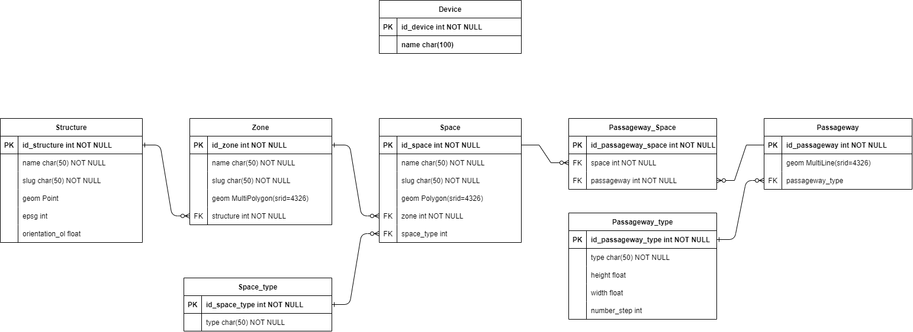

# Notice sur la base de données 'géoportail' du IUOC
Par Maxime Fourquaux, le 22 mai 2024

## Groupe de travail
- Yves Chevallier, iAi
- Jens Ingensand, insit
- Sébastien Guillaume, insit
- Maxime Fourquaux
- Daniel Rossier, reds

## Sommaire
- [Notice sur la base de données 'géoportail' du IUOC](#notice-sur-la-base-de-données-géoportail-du-iuoc)
  - [Groupe de travail](#groupe-de-travail)
  - [Sommaire](#sommaire)
  - [Modèle relationnel (édité avec draw.io)](#modèle-relationnel-édité-avec-drawio)
  - [Justification](#justification)
  - [Détails](#détails)
    - [Table `Structure`](#table-structure)
    - [Table `Zone`](#table-zone)
    - [Table `Space`](#table-space)
    - [Table `Space_type`](#table-space_type)
    - [Table `Passageway`](#table-passageway)
    - [Table `Passageway_Space`](#table-passageway_space)
    - [Table `Passageway_type`](#table-passageway_type)
    - [Table `Device`](#table-device)

## Modèle relationnel (édité avec draw.io)

## Justification
Le modèle présenté est plus léger que ce qui avait été discuté en séance.

On parle ici d'un géoportail pour visualiser la position des objets connectés liés au projet IUOC et intégrer à la base de données générales, avec ThingsBoard ([https://iuoc-tb.heig-vd.ch/home](iuoc-tb.heig-vd.ch)), donc les personnes, les données sur les salles de classes, etc... n'ont pas d'utilité ici.

## Détails
### Table `Structure`
La table `Structure` représente les données ultra généralistes de la table de données.

Le tableau ci-après détaille les différents attributs de la table:
| attribut       | variable             | clé | null ? | description                                                             |
| :------------- | :------------------- | :-- | :----- | :---------------------------------------------------------------------- |
| id_structure   | entier               | PK  | non    | identifiant unique de la structure                                      |
| name           | charfield, length=50 |     | non    | nom de la structure                                                     |
| slug           | charfield, length=50 |     | non    | slug de la structure, permet de faciliter la recherche avec l'API       |
| geom           | Point, srid=4326     |     | oui    | Position géographique en _EPSG:4326_ du point où est situé la structure |
| epsg           | entier               |     | oui    | Code EPSG pour facilier la visualisation des données                    |
| orientation_ol | float                |     | oui    | Valeur d'angle pour orienter les géométriques 'zone' et 'space'         |

__Exemple:__
| id_structure | name            | slug           | epsg |
| :----------- | :-------------- | :------------- | :--- |
| 1            | HEIG Cheseaux   | heig-cheseaux  | 2056 |
| 2            | HEIG Saint Roch | heig-saintroch | 2056 |
| 3            | HEIG Y-Parc     | heig-yparc     | 2056 |

### Table `Zone`
La table `Zone` représente les données particulières contenues dans une structure, par exemple: l'étage d'un bâtiment.

Le tableau ci-après détaille les différents attributs de la table:
| attribut  | variable                | clé | null ? | description                                                  |
| :-------- | :---------------------- | :-- | :----- | :----------------------------------------------------------- |
| id_zone   | entier                  | PK  | non    | identifiant unique de la zone                                |
| name      | charfield, length=50    |     | non    | nom de la zone                                               |
| slug      | charfield, length=50    |     | non    | slug de la zone, permet de faciliter la recherche avec l'API |
| geom      | MultiPolygon, srid=4326 |     | oui    | Polygone géoréférencé en _EPSG:4326_ qui représente la zone  |
| structure | entier                  | FK  | oui    | Clé étrangère de la table 'structure'                        |

__Exemple:__
| id_zone | name | slug | structure |
| :------ | :--- | :--- | :-------- |
| 1       | A    | a    | 1         |
| 2       | B    | b    | 1         |
| 3       | R    | r    | 2         |
| 4       | S    | s    | 2         |

### Table `Space`
La table `Space` représente les données particulières contenues dans une zone, par exemple: une salle d'un étage.

Le tableau ci-après détaille les différents attributs de la table:
| attribut | variable             | clé | null ? | description                                                  |
| :------- | :------------------- | :-- | :----- | :----------------------------------------------------------- |
| id_space | entier               | PK  | non    | identifiant unique du space                                  |
| name     | charfield, length=50 |     | non    | nom du space                                                 |
| slug     | charfield, length=50 |     | non    | slug du space, permet de faciliter la recherche avec l'API   |
| geom     | Polygon, srid=4326   |     | oui    | Polygone géoréférencé en _EPSG:4326_ qui représente le space |
| zone     | entier               | FK  | oui    | Clé étrangère de la table 'zone'                             |

__Exemple:__
| id_space | name | slug | structure |
| :------- | :--- | :--- | :-------- |
| 1        | A01  | a01  | 1         |
| 2        | A02  | a02  | 1         |
| 3        | B02  | b02  | 2         |
| 4        | B03  | b03  | 2         |

### Table `Space_type`
Cette table liste les différents types de space qui existe. Cela permet d'éviter les doublons.

Le tableau ci-après détaille les différents attributs de la table:
| attribut      | variable             | clé | null ? | description                 |
| :------------ | :------------------- | :-- | :----- | :-------------------------- |
| id_space_type | entier               | PK  | non    | identifiant unique du space |
| type          | charfield, length=50 |     | non    | nom du type                 |

__Exemple:__
| id_space_type | type         |
| :-----------  | :----------- |
| 1             | Classroom    |
| 2             | Meeting Room |
| 3             | Office       |
| 4             | Corridor     |

### Table `Passageway`
Cette table liste tous les passages existants. Cela peut être des passages de portes, des escaliers, ...

Le tableau ci-après détaille les différents attributs de la table:
| attribut        | variable             | clé | null ? | description                                                                  |
| :------------   | :------------------- | :-- | :----- | :--------------------------------------------------------------------------- |
| id_passageway   | entier               | PK  | non    | identifiant unique du passage                                                |
| geom            | MultiLine, srid=4326 |     | oui    | Géométrie pour représenter le passage                                        |
| passageway_type | MultiLine, srid=4326 | FK  | oui    | Clé étrangère de la table 'passageway_type' pour associer un type de passage |

__Exemple:__
| id_passageway | geom | passageway_type |
| :-----------  | :--- | :-------------- |
| 1             |      | 1               |
| 2             |      | 3               |
| 3             |      | 4               |
| 4             |      | 2               |

### Table `Passageway_Space`
Cette table permet d'associer un passage spécifique à un ou plusieurs 'space'.

Le tableau ci-après détaille les différents attributs de la table:
| attribut           | variable             | clé | null ? | description                            |
| :----------------- | :------------------- | :-- | :----- | :------------------------------------- |
| id_passageway_type | entier               | PK  | non    | identifiant unique du type de passage  |
| space              | entier               | FK  | non    | clé étrangère de la table 'Space'      |
| passageway         | entier               | FK  | non    | clé étrangère de la table 'Passageway' |

### Table `Passageway_type`
Cette table liste les différents types de passage qui existe. Cela permet d'éviter les doublons.

Le tableau ci-après détaille les différents attributs de la table:
| attribut           | variable             | clé | null ? | description                                 |
| :----------------- | :------------------- | :-- | :----- | :------------------------------------------ |
| id_passageway_type | entier               | PK  | non    | identifiant unique du type de passage       |
| type               | charfield, length=50 |     | non    | nom du type de passage                      |
| height             | float                |     | oui    | hauteur en __mètres__ du passage de porte   |
| width              | float                |     | oui    | largeur en __mètres__ du passage de porte   |
| number_step        | int                  |     | oui    | Nombre de marche d'escalier                 |

__Exemple:__
| id_passageway_type | type                                   | height | width | number_step |
| :----------------- | :------------------------------------- | :----- | :---- | :---------- |
| 1                  | Single-leaf door                       | 2.0    | 1.2   |             |
| 2                  | Double-leaf door                       | 2.0    | 1.6   |             |
| 3                  | Double-leaf door with different widths | 2.0    | 1.8   |             |
| 4                  | Elevator                               |        | 1.5   |             |
| 5                  | Staircase                              |        | 1.5   | 15          |

### Table `Device`
Cette table liste tous les objets connectés qui sont enregistrés générés et enregistrés dans Thingsboard. Cela permet de faire l'ensemble des requêtes sur l'API de Thingsboard.

Le tableau ci-après détaille les différents attributs de la table:
| attribut  | variable              | clé | null ? | description                                 |
| :-------- | :-------------------- | :-- | :----- | :------------------------------------------ |
| id_device | charfield, length=100 | PK  | non    | identifiant unique de l'objet connecté      |
| name      | charfield, length=100 |     | oui    | nom de l'objet connecté               |

__Exemple:__
| id_device                            | name                          |
| :----------------------------------- | :---------------------------- |
| f55c1260-0153-11ef-9842-e91c9eb37da9 | IUOC_INSIT_camera             |
| e33ad750-1207-11ef-9842-e91c9eb37da9 | IUOC_INSIT_capteur_particules |
